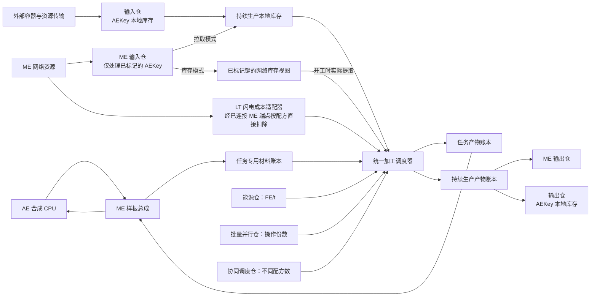
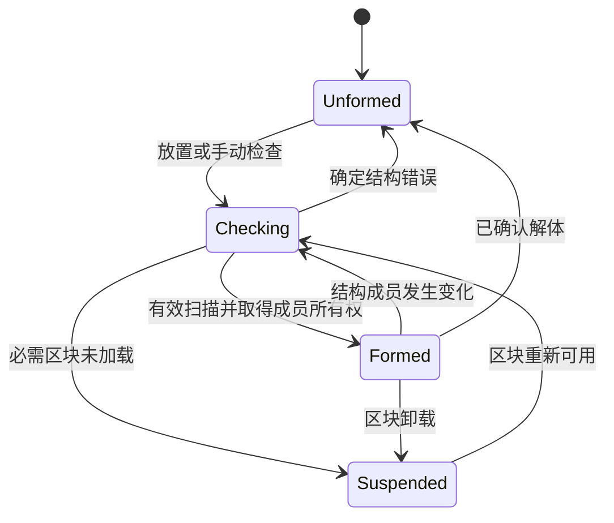
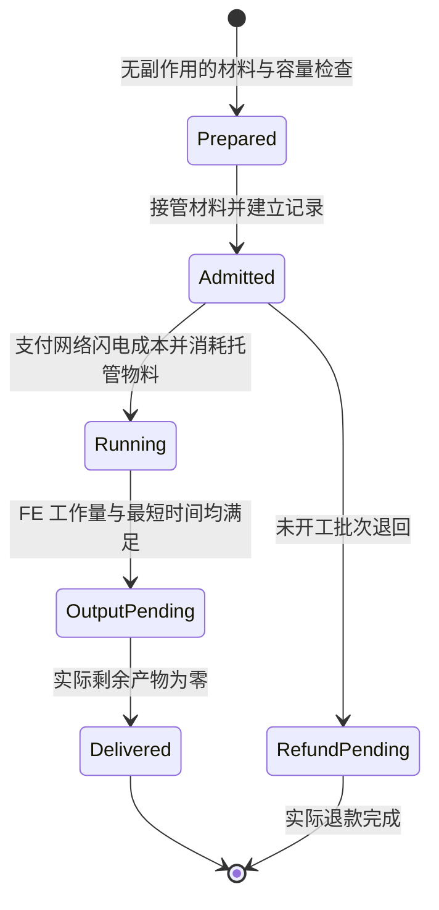

# 大型过载处理工厂与通用多方块框架设计

适用环境：Minecraft 1.21.1、NeoForge、Java 21。本文定义工厂功能、结构规则、仓室能力、加工协议和模块边界。表中的容量、等级数值与性能限额为默认设计参数，支持配置调整。

## 1. 设计目标

- 大型过载处理工厂采用多方块结构，支持现有过载工厂的全部有效配方，并通过适配器扩展配方来源。
- 功能部件包括 ME 样板总成、分级能源接入仓、分级批量并行仓、分级协同调度仓、T1–T4 普通输入仓与输出仓，以及单一规格的 ME 输入仓和 ME 输出仓。四类输入输出仓统一支持全部合法 `AEKey`，不按物品、流体拆分方块。ME 输入/输出仓不设标记数、键种类、本地容量或单键数量上限。
- 仓室安装在允许替换的外壳位置，每个仓室占一格结构方块。
- 外形支持数据包模板和可配置长、宽、高的长方体，并提供多种大型长方体预设。默认控制器嵌在外表面，与相邻外壳齐平。
- ME 样板总成接收 AE 合成任务，多块总成扩展样板容量并共享全厂加工能力；产物通过原总成返回原网络。
- ME 输入仓提供拉取模式和库存模式：拉取模式按标记补充本地缓冲；库存模式直接读取已标记键的网络库存，在配方开工时才扣料。ME 输出仓负责持续生产产物回网。
- 输入仓可开关自动拉取，输出仓可开关自动输出/弹出；ME 输入仓拉取模式的自动补料与 ME 输出仓的自动回网同样具有独立开关。
- 能源仓只处理 FE。需要闪电的配方由 LT 专用成本适配器直接从已连接的 ME 网络扣除，无需手动拉取、设置闪电标记或在样板中编码闪电。
- 虚拟加工以资源账本管理材料与产物，保留真实配方校验、加工时间、FE 和专有运行成本。
- 通用多方块框架独立于 LT 闪电玩法，先完成框架及独立验证，再基于框架构建工厂。

## 2. 集成边界

大型工厂使用独立注册 ID，与单方块过载工厂并存。通用结构框架位于 Thunderbolt Core Reborn，工厂内容、仓室及闪电适配位于 AE2 Lightning Tech Reborn。

| 对接模块 | 设计要求 |
| --- | --- |
| [过载配方目录](../src/main/java/com/moakiee/ae2lt/machine/overloadfactory/recipe/OverloadProcessingRecipeCatalog.java) | 读取最终 RecipeManager 中的本体、处理器推导与可选反应仓配方；不创建会绕过数据包删除的副本 |
| 材料分配 | 使用与物理槽数无关的输入视图及消耗计划，支持跨多个仓室取料 |
| [TB 批量 provider](../../Thunderbolt-Core-Reborn/src/main/java/com/moakiee/thunderbolt/api/crafting/batch/IBatchCraftingProvider.java) | 接收单份只读材料模板，返回未接收份数；所有总成共享工厂预算 |
| [TB 任务视图](../../Thunderbolt-Core-Reborn/src/main/java/com/moakiee/thunderbolt/api/crafting/batch/BatchJobView.java) | 仅在调用内借用，复制必要稳定标识，不保存 CPU 内部对象 |
| [矩阵回传契约](../src/main/java/com/moakiee/ae2lt/crafting/runtime/api/DeferredCraftingProvider.java) | 同步 OutputSink 不用于耗时任务；加工完成后走 AE 正常网络收货路径 |
| [闪电 API](../src/main/java/com/moakiee/ae2lt/api/lightning/LightningApi.java) | LT 适配器通过活动 ME 端点执行真实网络扣除；模拟查询不预留资源 |
| [控制器状态存储](../src/main/java/com/moakiee/ae2lt/logic/persistence/ControllerMachineStateSavedData.java) | 以机器 UUID 保存唯一权威运行状态，仓室不复制任务记录 |

跨仓库源码链接按两个项目同级检出组织。

## 3. 总体模型

工厂采用“一个控制器、一套运行账本、多种可替换仓室”的模型。结构体积提供安装空间；能源仓决定每 tick 能做多少工作，批量并行仓决定可同时加工的配方操作份数，协同调度仓决定同时运行的不同配方数量。增加样板容量不增加加工速度，扩大空壳也不直接增加吞吐。



图中的 AE 任务回传使用 AE 原有网络收货流程，不意味着工厂持有 CPU 对象或实现了新的直连回调协议。

## 4. 通用多方块框架的设计边界

通用框架负责结构与部件生命周期，具体机器负责配方、物流和运行成本。

### 4.1 两个项目的职责

无 LT 内容依赖的结构基础设施放在 Thunderbolt，把工厂玩法与加工执行放在 AE2LT。Thunderbolt 单独安装时不注册工厂、仓室、配方、闪电类型或工厂 GUI，也不反向依赖 LT。

| 所属项目 | 职责 | 不应承担 |
| --- | --- | --- |
| TB `core.multiblock` | 坐标变换、模板编译、替换规则、计数约束、扫描、成员归属、变更索引、生命周期事件 | 工厂配方、FE 数值平衡、闪电消耗、样板业务 |
| TB `api.multiblock`，成熟后开放 | 不可变结构定义、扫描结果、角色标识与最小生命周期契约 | 公开内部可变集群、允许调用方任意写入所有权表 |
| TB 现有批量 API | CPU 与机器之间的单份/批量派发契约 | 接管工厂任务、物理库存或工厂能耗 |
| LT `multiblock` | LT 方块到框架角色的适配、通用 AEKey 仓室与外部传输适配、结构预览和控制器交互 | 重新实现一套通用扫描器 |
| LT `machine.largeoverloadfactory` | 工厂定义、能力汇总、配方映射、调度、能源、任务记录、GUI | 修改 AE 规划器以识别某个具体工厂 |
| LT `crafting.processing` | 资源账本、加工样板编译和虚拟加工 provider | 假装任意加工样板均可直接生成其声称的产物 |
| LT 闪电运行成本适配器 | 解析本模组配方闪电成本、选择已连接网络、执行直接扣除与失败补偿 | 要求普通框架使用者安装闪电系统、给闪电设置标记或写入样板 |

公共 API 以不可变定义和最小生命周期契约为边界；内部调度器、所有权索引和机器状态不对外开放可变引用。本文的包名和类名定义目标模块结构。

通用加工契约通过可选运行成本扩展接入机器专有消耗，缺省为空。Thunderbolt 和通用仓室接口不导入 `LightningKey`，不预设每台机器都要消耗闪电；只有 LT 工厂适配器识别并执行这项成本。其他模组使用框架时，可以没有此扩展，也可以注册自己的专有成本策略。

### 4.2 结构定义

一份 `StructureDefinition` 应同时驱动成形扫描、预览、材料清单和自动搭建，避免四套坐标表发生偏差。

每个模板单元包含局部坐标、角色和允许的部件集合。至少区分以下语义：

- `FIXED`：控制器、框架、线圈、玻璃等固定部件，不允许仓室替换。
- `REPLACEABLE`：保留默认外壳，或替换为规则声明允许的仓室；替换后的方块仍占同一格。
- `INTERNAL_MODULE`：只接受机器定义声明的内部单元。
- `AIR_REQUIRED`：要求真正留空，不能塞入仓室或其他方块。
- `IGNORE`：纯视觉开口或未纳入结构的区域，不检查内容、不领取成员所有权。

角色使用有命名空间的标识；不能根据任意方块是否暴露物品/流体能力，就把它当成合法仓室。数据包标签可以声明兼容外壳，具有库存和服务的部件则必须有已注册的行为适配。

全局约束独立于单格规则，例如“控制器恰好 1 个”“能源仓至少 1 个”“每种端口不超过上限”“至少保留若干默认外壳”。几何成形约束与运行条件分开：缺少某种配方要求的输出仓可以使该配方不可用，而不必使整座建筑无法成形。

可变尺寸定义必须给出最小值、最大值、步长及唯一结束标记，不能沿世界无限查找。水平旋转通过同一个局部坐标变换处理；首期不支持镜像、倒置或任意斜向。

### 4.3 扫描、区块与所有权

`StructureScanner` 读取只读世界视图，返回 `VALID`、`INVALID` 或 `INCOMPLETE`：

- `VALID`：全部必需区块已加载，单格与全局规则均满足，得到不可变 `StructureSnapshot`。
- `INVALID`：已加载位置存在确定的错误，附错误坐标、期望集合、实际部件和约束说明。
- `INCOMPLETE`：存在未加载的必需区块，只能暂停，不能据此宣布方块丢失或清空任务。

对于大型或可扩建结构，必须枚举包围盒覆盖的所有区块；现有矩阵扫描“四角即可覆盖”的优化只适用于其很小的水平占地，不能推广为通用算法。读取方块前检查区块可用，不调用会隐式加载区块的路径。

扫描期间不绑定成员、不修改库存、不发布样板。提交绑定时一次性校验全部成员未被其他活动控制器占用，再更新所有权和结构版本。失败则不保留半成形结构。

成员引用至少包含维度、控制器位置、机器 UUID、结构版本和部件角色。两个控制器不能共享同一个仓室、框架或内部单元；复制控制器物品也不能同时领取同一运行状态。接收材料前重新验证活动所有权，不能只信任旧的 `formed=true` 方块属性。

### 4.4 生命周期与变更驱动



`Formed` 仅说明结构有效；缺电、缺闪电、没有活动网络和输出阻塞分别属于运行状态。GUI 同时显示结构状态和运行原因，避免把所有问题合并为“未成形”。

每维度维护成员位置和覆盖区块到控制器的反向索引。普通方块变化只标记有关控制器脏，同一 tick 合并请求；失效门禁立即生效，完整复扫可以排队。尚未成形的控制器登记有界候选区域，保证最后一块结构放好后仍能被唤醒。

稳定结构不逐 tick 遍历所有方块。库存、样板、配方和端口拓扑各自维护版本，变化只重建相应缓存。服务器线程执行所有世界、库存、网格和能量操作；后台线程最多处理已复制的不可变展示数据。

### 4.5 capability 与可替换仓室

仓室通过统一 AEKey 存储接口及物品/流体 capability 适配层提供物流，能源仓另行提供 FE 服务。仓室服务通过已验证的绑定访问工厂。解除绑定、旋转、拆换及区块卸载时失效旧 capability 缓存；已经被管道持有的旧包装器也必须检查版本并拒绝过期写入。

普通仓室自己的 AEKey 本地库存可以在解体后保留并通过有效的独立仓室接口读写；工厂任务托管中的材料不属于该库存，不能通过旧包装器取出。自动物流和 ME 服务只有在结构和当前端口授权条件满足时才工作。

框架只通知 `onFormed`、`onSuspended`、`onReformed` 和 `onDisassembled` 等事件，不擅自退款、掉落物品或丢弃加工进度。具体机器决定处理策略，并必须保留已接收资源的唯一归属。

### 4.6 既有多方块迁移

先用新工厂验证框架，再按“模板坐标与扫描 → 成员绑定 → 预览与自动搭建”的顺序逐步迁移矩阵和天枢。它们的核心规则、尺寸、端口数量、样板库存和 UUID 存档格式保持兼容，由各自适配层承接。

矩阵的热度、线程预算和 5 tick 产物回流是其机器策略，不进入通用结构核心。旧存档迁移采用版本化读取和一次性所有权转移；不能在同一版本同时保留两套会产生产物的活动运行实例。

## 5. 虚拟加工必须遵守的资源契约

普通仓室与 ME 仓室共享加工能力，分别保持材料来源和任务所有权；具体运行流程见第 9 节。

### 5.1 材料来自谁

AE 合成 CPU 已经为 `pushBatch` 提取了所派发材料。工厂只从该次调用提供的模板复制实际接收份数的资源明细，不再次从网络抽取这些材料。主动持续生产则由工厂自行取料；两条路径必须有明确的来源标记，不能对同一资源同时套用。

持续生产的普通物料来源分为输入仓本地库存、ME 输入仓拉取模式的真实缓冲、ME 输入仓库存模式的网络视图。网络视图仅提供查询，不代表工厂已经接收物料；开工准备时实际提取成功，才能把对应数量记入工厂托管。仅凭网络显示量不登记已取得资源，也不生成可完成的加工批次。

LT 配方的闪电属于独立运行成本，不属于这两条路径中的样板物料或标记物料。开始运行时由专用适配器直接从选定 ME 网络扣除，并以批次记录防止重复计费。

`oneCopyTemplate` 是借用的单份只读模板。返回值 `leftover` 必须满足 `0 <= leftover <= offered`，实际接收为 `offered - leftover`。例如调用方提供 100 份、工厂接受 24 份，应返回 76；未接受的 76 份由 CPU 自己返还。

`BatchJobView.craftingId()` 只能提供可选任务身份，不是每次派发的唯一序号。一个任务可以多次发送完全相同的样板和材料，因此不能用“任务 ID + 样板 ID”去重正常派发。工厂为每次成功接受建立自己的单调提交序号；若未来需要跨端重试幂等，必须先增加调用方也遵守的唯一提交令牌协议。

### 5.2 校验真实配方

样板描述的是期望加工关系，不授予直接生成任意物品的能力。发布与派发前必须证明样板对应当前工厂允许的真实配方，且实际材料、数量、组件、流体与产物相符。

使用 `AEItemKey`、`AEFluidKey` 或其他明确支持的键记录完整资源身份；不能仅按物品 ID 合并。标签和模糊输入在配方绑定时解析，派发时再次用真实选中的键验证；不支持的自定义 Ingredient 或动态产物明确拒绝，不猜测结果。

多种 Ingredient 可能竞争同一种物料。分配器需要形成无重复占用的消耗计划，不能分别检查每种原料“库存够用”后就认定整个配方可执行。

### 5.3 接收与产出分离

成功接收表示工厂已取得材料所有权，不表示产物已经完成。耗时工厂在后续 tick 扣除加工能源，满足工作量条件后才生成产物。

接收前完成配方校验、能力检查、数量溢出检查、在途记录与输出账本空间预留。调用中尚未提交时发生确定拒收，可以返回全部未接收份数；已经接管材料后遇到异常，必须进入故障恢复并保留记录，不能伪装成拒收让 CPU 再次退料。

普通 AE 回流至少安排在派发返回、CPU 登记待收产物之后。不得在 `pushBatch` 内同步插入普通网络库存，以免 CPU 尚未记账，产物被当成无关库存。

矩阵的 `DeferredCraftingProvider.OutputSink` 是一次调用的同步所有权转移机制，不能保存在耗时任务里。工厂第一阶段通过正常网络存储插入完成产物，让 AE 的原有合成收货逻辑处理；不新增自有 CPU 或替换全局规划器。

### 5.4 真实扣除、退款与背压

NeoForge 与 AE 的 `SIMULATE` 不是事务锁，也不保证之后能取得相同数量。对多个库存或多种资源的实际提取可能部分成功；将已经成功取出的部分放入工厂的有界托管区。补齐失败时按已记录数量返还，返还被拒则进入退款缓冲等待处理，不能销毁资源或凭预估生成产物。

产物插入也允许部分成功。对每个键按“请求数量减去实际插入数量”更新剩余账本；只有剩余量全部为零才能删除记录。控制器的活动任务、尚未完成所有权移交的输出/退款事务和诊断记录设运行预算，满时暂缓新事务。已经移交给 ME 输入/输出仓的真实库存不受该事务预算限制，不以队列上限代替仓室容量上限。

完成产物、未开工原料、已经消耗的原料与能源必须分别记账。同一份资源不能既保留在普通仓室中，又被任务算作已接收，也不能在取消时同时返还原料并保留对应成品。

### 5.5 持久化保证的范围

目标是保证正常 tick 执行、部分接收、断网、结构拆换、区块卸载以及正常保存/加载过程中的资源守恒。运行记录由一个机器 UUID 下的权威存储管理，仓室仅保存自身库存和绑定信息，不能复制任务记录。

Minecraft 的多个区块、SavedData 和 AE 网络库存并不提供跨文件原子提交；一次 `setDirty` 也不等同于磁盘提交。因此第一阶段不能声称在任意进程崩溃或外部备份回滚下实现端到端 exactly-once。跨存储恢复不一致时进入可诊断的隔离恢复状态，避免盲目重发；若要进一步保证，需要 CPU、机器和资源存储共同参与的提交/恢复协议。

## 6. 工厂结构与自定义外形

### 6.1 默认长方体

尺寸统一写为“宽 X × 高 Y × 深 Z”。控制器嵌在长方体前表面，与相邻外壳齐平，计入外壳和总体尺寸；结构向控制器背面延伸。控制器不是内部中心方块，内部处理核心是另一个部件。默认提供以下预设，选择预设只是填写尺寸，不附带隐藏性能倍率：

| 预设 | 尺寸 | 用途 |
| --- | --- | --- |
| 标准工业型 | 9×7×9 | 初次建设，能安装完整的一套输入、输出、供能和并行仓室 |
| 集群生产型 | 13×9×13 | 多路持续生产与较多样板总成 |
| 中央处理型 | 17×11×17 | 大型基地中央工厂与大量外部管线接入 |

默认允许宽/深 `7–31`、高 `5–15`，不强制奇数。偶数尺寸的控制器和中央核心使用 `floor(size / 2)` 定位，预览明确标记位置。框架还应限制模板总体积和最大跨度；尺寸范围是工厂策略，不硬编码进通用扫描器。

默认生成规则按以下优先级应用：

1. 前表面 `(floor(W/2), floor(H/2), 0)` 为唯一控制器，替代该位置的一格外壳；这是预设的表面中央锚点。世界中的前表面由控制器朝向决定，四个水平朝向均保持控制器在表面。
2. 至少两个坐标位于边界的格子为固定“过载约束框架”，包括 12 条棱与 8 个角。
3. 其余外表面为可替换外壳位：接受过载工厂外壳、观察玻璃或白名单中的仓室。
4. 内部几何中心为一个固定“过载处理核心”。该核心用于表明工厂类型并满足配方执行的结构要求，本身不替代能源仓或并行仓；持久化机器身份仍归控制器所有。
5. 其他内部格子要求为空。数据包可以另行定义线圈、装饰夹层和异形内部结构。

默认至少保留 32 块真正的工厂外壳，观察玻璃与仓室不计入这个数量；总仓室数默认最多 64。固定棱角、控制器和处理核心不得被仓室替代。

以 9×7×9 为例：总体积 567，外壳占 322 格，其中固定棱角 84 格、控制器 1 格、可替换外表面 237 格；内部为核心 1 格和空气 244 格。完整结构需要 323 个实际方块，外表面的外壳、玻璃和仓室数量随配置变化。

### 6.2 数据包模板

定义路径为 `data/<namespace>/multiblocks/<path>.json`，由框架统一加载。工厂控制器提供“长方体”与“数据包模板”两种选择，保存模板 ID 或三个尺寸值。

框架需要两种定义入口：

- 参数化生成器：例如长方体，根据尺寸生成最终格子表。
- 分层模板：声明尺寸、锚点、字符层、角色表和计数规则，可表达非长方体外形。

两种入口最终编译为同一个不可变 `StructureDefinition`。异形模板不是自动识别任意建筑；玩家按照已选模板建造，扫描器验证它。

结构定义采用以下 JSON 格式：

```json
{
  "format": 1,
  "machine": "ae2lt:large_overload_processing_factory",
  "shape": {
    "type": "ae2lt:factory_cuboid",
    "default_size": [9, 7, 9],
    "minimum_size": [7, 5, 7],
    "maximum_size": [31, 15, 31]
  },
  "constraints": {
    "minimum_casings": 32,
    "maximum_hatches": 64,
    "minimum_energy_hatches": 1
  }
}
```

分层模板中，角色至少声明 `kind`、默认搭建方块和允许替换的部件标签。配方逻辑、FE 提取和资源插入仍由已注册的机器/仓室行为负责；JSON 不提供任意 Java 调用能力。

模板加载时检查未知角色、重复坐标、层尺寸不一致、多个控制器、锚点不合法、无限范围和无法满足的数量约束。`AIR_REQUIRED` 与 `IGNORE` 必须使用不同字符，材料统计不计空气和忽略位。

### 6.3 成形、运行与修改尺寸

成形要求结构正确、一个控制器、一个处理核心、至少一个能源仓，并满足模板计数规则。其余仓室按生产方式配置：没有样板总成仍可持续生产；输入仓和输出仓可同时处理物品、流体等键；没有可用输出路径或容量时，只禁用需要它的配方。

默认允许零个并行仓和零个调度仓，分别提供基础 `1` 份操作与 `1` 个配方通道。这样玩家能直观看出两种升级的作用。实际配方需要闪电时，必须有已绑定且活动的 ME 网络端点，并能从其网络实际取得所需闪电；不要求 ME 输入仓预存或标记闪电。

修改尺寸或模板前进入维护状态：停止接单、暂停自动取料、处理或保留在途任务，再使旧结构绑定失效。新模板验证通过后重新绑定；不能自动拆掉旧方块、清空仓室或把超出的库存挤掉。

自动搭建沿用现有机器的交互习惯：展示缺料与阻挡位置，只消耗玩家背包中的方块，保留已合法安装的仓室，默认只填外壳和固定结构件。仓室位置由玩家确定；预设可以提供示例布局，但不能替换有库存的现有部件。

## 7. 仓室目录与命名

仓室名称及功能如下。所有仓室都是一格方块，放在允许替换的外壳位；有方向的服务只面向结构外侧。壳体本身不传递 FE，不充当 ME 线缆。

| 名称 | ID 后缀 | 主要能力 | 默认等级与数量上限 |
| --- | --- | --- | --- |
| ME 样板总成 | `factory_pattern_assembly_t1/t2` | 保存加工样板，发布 provider，接受任务并将产物回原网 | T1 36 槽、T2 72 槽；最多 16 块 |
| 能源接入仓 | `factory_energy_hatch_t1...t4` | 外部 FE 接收、独立储能、向工厂供电 | T1–T4；最多 8 块 |
| 批量并行仓 | `factory_parallel_hatch_t1...t4` | 提升全厂可同时承载的操作份数，也限制单个配方的最大批量 | T1–T4；最多 8 块 |
| 协同调度仓 | `factory_scheduling_hatch_t1...t4` | 提升同时运行的不同配方数量 | T1–T4；最多 4 块 |
| 输入仓 | `factory_input_hatch_t1...t4` | 接收任意合法 AEKey，本地存储；可开关从相邻容器自动拉取 | T1–T4；最多 16 块 |
| 输出仓 | `factory_output_hatch_t1...t4` | 存储持续生产产物；可开关向相邻容器自动输出/弹出 | T1–T4；最多 16 块 |
| ME 输入仓 | `factory_me_input_hatch` | 拉取模式按标记补料；库存模式直接读取已标记键的网络库存 | 单一规格，标记数与容量无上限；最多 16 块 |
| ME 输出仓 | `factory_me_output_hatch` | 存储持续生产产物；可开关自动回网 | 单一规格，过滤数与容量无上限；最多 16 块 |

所有分类上限还受全厂 64 块总上限约束。观察玻璃、外壳和处理核心不是功能仓室。

### 7.1 输入仓与输出仓

普通物流只有“输入仓”和“输出仓”两种方块，各有 T1–T4 等级。每个仓使用同一套 `AEKey -> long` 本地库存，可混合保存物品、流体及第三方注册的其他合法键；不同键类型共用键种类名额，各键的数量按对应类型单位计量。

输入仓允许外部插入和取回闲置资源；输出仓接收机器产物，外部只能提取。工厂从所有输入仓形成统一物料视图，同一键可跨仓满足配方，组件不同的键严格区分。已转入任务托管的资源从仓内扣除，不允许外部再次取走。

仓室提供统一的按键查询、插入、提取及模拟接口。物品和流体 capability 是同一库存的适配视图，不再建立另一份独立槽位/储罐库存。物品管道只操作物品键，流体管道只操作流体键；其他键由通用 AEKey 传输接口或已注册的类型适配器传输。支持任意键的存储，不代表没有适配器的任意邻居都能传输该键。

所有适配视图共享库存版本、容量与实际扣数。接口返回稳定的槽位/罐索引，不因键排序变化使同一个缓存索引突然指向另一种资源；键变更时正确更新或失效相应视图。外部 `int` 数量接口分次操作内部 `long` 计数。

输入仓可选精确键过滤，并带“自动拉取”开关；输出仓可选精确键过滤，并带“自动输出”开关。自动物流只作用于玩家启用的外侧方向，提取/插入多少就记账多少，部分失败的剩余资源保留。开关和运行规则见第 7.7 节。

### 7.2 ME 输入仓

ME 输入仓提供两种模式，默认使用拉取模式；两种模式都只处理启用的标记键。没有标记时，不提供普通配方物料。标记是配置，不是真实资源；精确保留 AEKey 类型与组件，不消耗用于设置标记的物品，也不生成物料。

| 行为 | 拉取模式 | 库存模式 |
| --- | --- | --- |
| 物料位置 | 先从网络提取到仓内本地缓冲 | 普通物料继续留在网络中 |
| 标记含义 | 指定键、目标缓冲量、可选低水位与启用状态 | 指定要读取的键与启用状态 |
| 工厂看到的数量 | 仓内实际持有量 | 网络中该标记键的可访问量 |
| 扣料时点 | 自动补料时从网络扣除，开工时从仓内扣除 | 配方开工时从网络实际扣除 |
| 容量 | 本地键种类与每键数量无上限，标记数无上限 | 标记数无上限，直接读取网络能提供的数量；不创建本地库存副本 |
| 自动拉取开关 | 控制后台补料，关闭后仍可使用已拉取物料 | 不适用，不进行后台搬运；开工扣料属于加工操作 |
| 断网 | 可使用已经拉入的普通物料 | 不能把过期显示量当成可提取物料 |

**拉取模式：** 每 5 tick 执行一轮限额补料，库存变化可以提前唤醒。自动拉取开启时，把启用的标记键逐步补到玩家设置的目标量；目标量不设机器侧硬上限，但它本身是补料停止条件。新标记的初始目标取标记操作所选数量，可编辑为任意非负整数，设为 0 表示不补料。不自动发起 AE 合成请求。关闭自动拉取只停止后台补料，不清空本地库存，也不停止工厂消耗已取得的物料。

**库存模式：** 对每个标记直接读取所属网络的库存，不生成或保存一份数量相同的本地库存。匹配阶段使用带来源的网络视图；只有已选配方准备开工时，才对该批实际所需数量执行真实提取。网络中的显示量不是资源预留，权限、连接和数量在实际提取前再次检查；不足时不开始加工，已部分提取量按原路返还或进入有界恢复账本。

库存模式不使用目标缓冲量与低水位，界面隐藏这两个输入项。切回拉取模式时恢复此前保存的补料配置。暂停库存模式的参与使用标记启用开关或控制器生产开关，不把自动拉取开关解释为停机开关。

同一网络、同一键被多个库存模式 ME 输入仓标记时，只形成一个可用量来源，不能把一份网络库存相加多次。来源标识至少包含运行期网格身份与 AEKey；不同端口权限存在差异时，仅使用可执行相应提取的端点，不把多个可见量累加。普通仓本地库存、拉取模式真实缓冲与库存模式网络视图统一交给材料分配器，但始终保留各自来源。

拉取模式切换到库存模式前，停止新补料并处理现有本地资源：优先原路返还，返还受阻则保留在“模式切换待返还”区，直到排空后才激活网络库存视图。这样本地余料不会与网络视图重复计入。库存模式切回拉取模式时，先停止旧视图接受新分配，再启用补料；已提交任务按原有来源继续完成。

删除标记只移除资源使用规则。拉取模式已有资源需要返还或保留恢复；库存模式删除标记只停止该键参与新匹配，不触碰网络中的真实物料。与既有任务相关的退款记录不能随标记删除而丢失。

四类输入输出仓均接受合法 AEKey；配方是否能使用该键取决于配方适配器。LT 闪电运行成本仍使用第 7.5 节的直接扣除路径，不占标记名额，不依赖拉取/库存模式，也不受自动拉取开关控制。

### 7.3 ME 输出仓

ME 输出仓为单一规格，使用无容量上限的 AEKey 本地库存，不设拉取/库存模式。默认接受全部持续生产产物，也可按键或键类型过滤，过滤条目数不设上限。“自动输出”开关控制是否把产物插回网络；关闭或网络无法接收时继续保留本地产物，不因虚构的仓室满载状态停止生产。每 tick 交付预算和控制器事务预算仍约束实际处理速度。

产物从工厂待交付账本转入输出仓后，其所有权归输出仓；回网时按实际插入量从仓内扣除。多个输出仓按优先级选择，同优先级轮询，不向所有仓复制一份。仓内已接收的产物不得再次由控制器重复发送。

输出仓与 ME 输出仓同时存在时，控制器为每种资源设置路由优先级，默认 ME 输出仓优先、普通输出仓兜底。二者都能接收任意合法键；普通输出仓能否继续向邻居弹出该键取决于传输适配器，没有适配器时保留库存并显示阻塞原因，不把非物品键伪造成物品掉落。

ME 输出仓不是网络存储总线，不把工厂所有输入、任务托管和在制品同时暴露成可自由提取的 ME 库存。任务产物按原路返回样板总成，不能被持续生产输出规则改道。

### 7.4 ME 样板总成

样板总成的 GUI 管理真实加工样板，控制器提供全厂聚合视图，并接入样板访问终端。每一张样板的物理所有者仍是具体总成，拆除时不得重复掉落。

每块总成只发布自己持有的有效样板，所有总成调用同一个工厂调度器；聚合 GUI 展示全部容量。这样不会出现每块总成都重复发布全厂所有样板的问题。重复放置相同样板允许作为玩家选择，但不会使全厂并行、配方通道或能源预算翻倍。

样板移除后立即停止发布新任务，已经接收的工作按其配方快照完成。升级 T1 到 T2 原位保留样板；降级必须先使槽位占用符合低级容量，不自动丢弃溢出的样板。

### 7.5 LT 专用闪电运行成本适配

能源仓只接收 FE。需要闪电的配方由 LT 专用适配器通过工厂已连接的 ME 端点，直接查询并扣除网络中的闪电。玩家只需保证网络中存在所需闪电，无需把闪电拉到仓内、设置资源标记或写入加工样板。FE、AE 待机消耗和闪电各自独立计费。

**接入路径：** 任一已绑定、可执行存储操作的活动 ME 样板总成或 ME 仓室均可提供网络接入，不要求额外安装专用闪电方块。样板任务默认使用接单总成所在网络；持续生产默认使用活动 ME 输入仓所在网络，没有输入仓时可使用其他已绑定 ME 端点。多个端点连接同一网格时先去重；存在多个不同网格时按确定的端点优先级选定一个来源网络，不把不同网络库存暗中合并为一份可用量。

**计费时点：** 批次接收时可查询闪电可用量以限制接收规模；即将由 `Admitted` 进入 `Running` 时，才对确定执行次数进行真实网络扣除。仅查询可用量不预扣，不为空闲机器囤积闪电。扣除成功后记录来源端口、实际键与数量以及已支付状态，该批后续 tick、断电恢复和产物回流均不再次扣除。

**失败处理：** 查询与实际扣除之间库存可能变化。实际取得不足时不启动加工，保留已接收普通物料等待；已部分取得的闪电先按原路补偿返还。退款受阻时使用有界内部恢复账本保存实际取得量，在退款完成前不重新执行该批扣费。该账本用于失败恢复，不是玩家需要配置的补料仓。原网络无法解析时暂停恢复，不把退款转到任意其他网络。

**等级替代：** 默认提供闪电等级替代能力：在处理核心专用升级槽装入一枚闪电塌缩矩阵后，可按 4:1 用高压补足极高压需求。该升级负责等级替代，同配方并行由批量并行仓提供。适配器对两种键的实际提取分别记账，不能在一种已成功、另一种失败时让批次开始或再扣成功的部分。

**样板与扩展边界：** 本工厂样板只描述普通加工物料与产物，闪电需求来自真实 LT 配方/工厂适配策略。把闪电运行成本额外写进样板时提示删除该项，不同时支持第二套由 CPU 供闪电的计费路径。其他模组使用通用框架时缺省没有闪电成本；借用到本工厂的配方是否增加闪电消耗，沿用本工厂已经明确的适配规则，不反向改变原机器。

**断网：** 尚未支付闪电的批次等待可用网络；已经完整支付闪电的批次在结构有效且 FE 可用时可以继续加工，产物回网失败则等待交付。没有闪电成本的配方完全跳过该适配器，不因此要求联网。

### 7.6 普通仓等级与 ME 仓容量

普通输入仓和输出仓使用 T1–T4 容量等级。等级决定本地键种类数量与每键容量，不改变 AEKey 支持范围；T1 也能接受全部合法键类型。

| 普通仓等级 | 本地不同键上限 | 每键物品容量 | 每键流体容量 | 其他键每键默认容量 |
| --- | ---: | ---: | ---: | ---: |
| T1 | 16 | 16,384 个 | 1,024,000 mB | 65,536 原生单位 |
| T2 | 32 | 65,536 个 | 4,096,000 mB | 262,144 原生单位 |
| T3 | 64 | 262,144 个 | 16,384,000 mB | 1,048,576 原生单位 |
| T4 | 128 | 1,048,576 个 | 65,536,000 mB | 4,194,304 原生单位 |

普通仓的每个不同 AEKey 占一个名额，物品、流体和其他键混合使用同一组名额。每个键分别受对应数量上限约束，不把“一个物品”和“一 mB 流体”直接相加计算总容量；同一普通仓里重复添加同一个键只合并数量，不能再占一个名额绕过每键上限。其他键按 AEKeyType 的原生单位计量，类型适配器或配置可覆盖其容量与显示单位。

普通输入/输出仓的过滤键数量上限等于该等级的键名额。容量预留必须覆盖已接受但尚未写入的资源，不能先承诺无限产物再发现普通仓装不下。普通仓原位升级保留全部资源、过滤、开关和路由配置；降级前必须满足目标等级的数量与键名额限制，否则拒绝降级并显示超出项。配置降低容量后以排空方式恢复合规，不截断资源数量。

ME 输入仓和 ME 输出仓不适用上表，只有一个注册规格：

- 标记与过滤条目动态增长，不设数量上限，界面采用分页、搜索和增量同步。
- 本地不同键数量、每键真实数量和总库存量不设设计上限；待返还本地物料同样不会被容量截断。
- ME 输入仓拉取模式按目标量补料；库存模式只读取标记键的网络库存，不为网络显示量创建本地资源。
- ME 输出仓在断网或自动输出关闭时保留已接收产物，可继续接收后续实际产物；网络库存容量不决定该仓的本地容量。
- 单次调用、单 tick 传输和工厂同时加工份数仍有执行预算，耗尽后延后处理，不拒绝资源类型、不删除标记，也不宣称仓室已满。

ME 仓室的本地数量与拉取目标量使用非负 `BigInteger`，避免以 `Long.MAX_VALUE` 充当隐藏的单键容量上限。普通 AE/NeoForge 接口通过 `long`/`int` 有限窗口读写同一份物理库存；具备 [BigMEStorage](../../Thunderbolt-Core-Reborn/src/main/java/com/moakiee/thunderbolt/api/storage/BigMEStorage.java) 的路径可读取、插入和提取精确大数量。外部网络只提供 `long` 信息时，界面按其真实可提供的信息显示，不伪造超出该接口范围的精确网络数量。

库存模式下，标记只选择资源，不设置可读数量上限。实际加工规模仍取决于全厂并行、配方通道、网络能真实提取的物料和控制器运行预算。开工前预留托管与退款事务记录空间；暂时没有执行额度时等待下一轮，不改变 ME 仓室的容量语义。

### 7.7 自动拉取与自动输出开关

开关控制仓室主动发起的物流操作，不禁止外部设备通过正常权限与方向规则主动访问仓内真实库存。

| 仓室 | 开关 | 默认值 | 开启时 | 关闭时 |
| --- | --- | --- | --- | --- |
| 输入仓 | 自动拉取 | 关闭 | 从启用方向的相邻容器按过滤与容量拉取 | 仅停止主动拉取，仍接受外部管道插入，工厂可使用现有库存 |
| 输出仓 | 自动输出 | 关闭 | 向启用方向的相邻容器弹出产物 | 产物保留，外部管道仍可主动提取 |
| ME 输入仓：拉取模式 | 自动拉取 | 开启 | 按标记、目标量与低水位从网络补料 | 保留并可消耗已有缓冲，不继续后台补料 |
| ME 输入仓：库存模式 | 无后台拉取开关 | 不适用 | 启用标记直接提供网络库存视图，开工时实际扣料 | 通过禁用标记或暂停生产来停止参与加工 |
| ME 输出仓 | 自动输出 | 开启 | 按执行预算把本地待输出产物插回所属网络 | 保留本地产物，可继续接收实际产物；允许外部适配接口主动提取 |

普通仓室的自动物流使用与被动接口相同的按键传输适配器，按方向轮询并受统一操作预算约束。没有可用适配器的键不会被强制转换；显示“无可用输出适配器”或保留待传输状态。

默认每 5 tick 调度一轮主动物流，邻居或库存变化可提前唤醒；一个仓室同 tick 的多方向调用共享额度。切换开关只影响后续操作，已经成功取得或交付的部分仍按实际量记账。原结构失效、维护暂停或区块不可用时停止主动物流。

这些开关不控制 LT 闪电自动扣费，也不控制样板任务经原总成回流；两者分别属于配方运行成本和 AE 任务交付。只有全厂生产/接单开关、网络权限与相应运行条件能暂停它们。

## 8. 能源、同配方并行与跨配方调度

以下数值为默认设计参数。

### 8.1 能源接入仓等级

| 等级 | 容量 | FE/t 接收上限 | FE/t 内部供能上限 |
| --- | ---: | ---: | ---: |
| T1 | 640,000,000 | 2,000,000 | 2,000,000 |
| T2 | 2,560,000,000 | 8,000,000 | 8,000,000 |
| T3 | 10,240,000,000 | 32,000,000 | 32,000,000 |
| T4 | 40,960,000,000 | 128,000,000 | 128,000,000 |

不同等级可以混装，容量和吞吐分别求和；每个仓保留独立储能。一个仓同 tick 被多个方向、多根管道重复调用，也只能共用一份接收限额；模拟调用不消耗限额。内部供能同样按仓计费，不能通过反复请求重置。

等级只改变吞吐和容量，没有电压不匹配爆炸，也没有“装一个高等级仓就让低等级仓全部升级”。FE 充足但吞吐不足时，工厂延长加工时间，不凭空提高功率。

### 8.2 批量并行仓等级

| 等级 | 增加的同时加工份数 |
| --- | ---: |
| T1 | 255 |
| T2 | 1,023 |
| T3 | 4,095 |
| T4 | 16,383 |

基础能力为 1，因此单个 T1/T2/T3/T4 的全厂能力分别为 256、1,024、4,096、16,384 份。多个仓线性叠加，默认总上限 65,536：

`P = min(65,536, 1 + Σ并行仓贡献)`

“份”指执行一次源机器配方，不是产物个数，也不是一张样板。若一张样板编码源配方 4 次，接收 100 份样板就占用 400 份操作预算。

所有已接收且未完成加工的批次共享 `P`；空余份数不足时允许部分接收。完成加工但还在等待回网的产物不继续占操作份数，但仍占有界输出账本容量；输出账本满后禁止接新单。

### 8.3 协同调度仓等级

| 等级 | 增加的不同配方通道 |
| --- | ---: |
| T1 | 1 |
| T2 | 3 |
| T3 | 7 |
| T4 | 15 |

基础通道为 1，单个仓分别得到 2、4、8、16 路；多个仓相加，默认封顶 64 路：

`R = min(64, 1 + Σ调度仓贡献)`

通道按源配方 ID 与执行指纹分组，不按样板槽数计算。同一配方的多个订单可共享一个配方通道，但仍分别保存材料、任务来源、批次和产物，不能把不同 CPU 的所有权混在一起。

安装更多调度仓不会增加 `P` 或 FE/t。以 `P = 1,024`、`R = 4` 为例，可给四种配方各分配 256 份，也可分配为 512、256、128、128；不能给四种配方各分配 1,024 份。只有一种配方繁忙时，它可以使用全部空余份数。

### 8.4 耗能与调度策略

大型工厂采用稳定、可拆分的线性加工能耗：`E_batch = E_recipe × 源配方执行次数`，闪电也按真实执行次数计费。旧单方块工厂继续使用旧的非线性并行公式；新工厂不调用依赖旧库存最大并行值的 `computeTotalEnergy`。

这种差异是新机器的平衡设计：大型结构与仓室成本换取线性批量效率，不改配方材料和产出。以后若增加超频，必须把额外耗能倍率显式写入加工快照，不能仅因当次订单被拆成几个批次而改变总消耗。

首期保留最少 4 个有效加工 tick。按批次剩余 FE 工作量分配当 tick 功率，扣了多少 FE 就累计多少已完成工作；不能在派发时直接把所有输出记为完成。断电暂停，不倒退进度。

例如单次配方 400,000 FE、1 个高压闪电，执行 256 次需要 102,400,000 FE 和 256 个高压闪电。一个持续供能的 T2 仓需要至少 13 tick；一个 T4 仓理论能在一个 tick 付清 FE，但仍受 4 tick 最短时间限制。未计入其他同时运行配方的功率分享。

调度采用有界公平轮询：同一来源内部轮询配方，AE 任务与持续生产默认按 3:1 权重分享新接收机会，空闲额度可借用。较小订单不会永久被大批次挤掉，同一台设备也不能因为持有更多样板总成反复获得独立预算。

移除仓室导致容量低于在途占用时，停止新接收，保留已有批次。重新成形后以当前 FE 吞吐运行；跨配方通道减少时，其余配方暂停轮候，不作废已接收材料。

## 9. 两种生产流程

### 9.1 AE 样板任务

1. 玩家向 ME 样板总成放入加工样板。总成将其绑定到当前有效工厂配方，无法绑定的样板保留在槽位并显示原因，不向 AE 发布。
2. AE 自己规划合成。CPU 向样板总成发送单份或批量材料；工厂不参与全局配方规划。
3. 总成检查结构、所属机器、样板版本、配方通道、空余操作份数、网络闪电可用量和账本空间。
4. 工厂复制实际接受的材料，预留完成产物需要的账本容量，建立任务记录，然后返回准确的未接收份数。
5. 开始加工时由 LT 适配器直接扣除所需网络闪电；不足则等待。扣除成功后执行 FE 加工，达到工作量和时间要求后，把产物写入该任务的待交付账本。
6. 通过原样板总成的网络端点插入产物，由 AE 原有 CPU 收货机制处理；插不进去的部分保留重试。

这条流程的普通物料由 CPU 交付，闪电通过已联网的样板总成自动扣除，不要求 ME 输入仓设置任何标记。即使工厂没有 ME 输入仓和 ME 输出仓，也能完成样板任务。

多个样板总成可以同时接单，但所有 `getBatchCapacity`/`pushBatch` 调用必须读取同一份全厂预算。`getBatchCapacity` 是提示，实际接收仍在 `pushBatch` 内重新核验。使用 TB 批量模式时可以选择 `UNBOUNDED` 的批量记账语义，但仍受有限 CPU 派发预算、物料、工厂份数与能源条件约束，不能宣称无限执行。

首期 `supportsSharedBatchInputs()` 保持 `false`。未来有不消耗模具的配方时，再为共享输入设计独立的归属、返还与跨批次租用协议，不能仅因接口存在就启用。

### 9.2 持续生产

1. 玩家在 ME 输入仓标记要提供给工厂的 AEKey，并选择拉取或库存模式；输入仓也可以提供本地物料。闪电运行成本无需标记。
2. 拉取模式在自动拉取开启时补充标记物料到本地目标量；库存模式直接查询标记键的网络可用量，不提前搬运。普通输入仓由外部管道供料，或通过开启自动拉取从相邻容器取料。
3. 控制器将本地库存与去重后的网络视图合并为带来源的匹配视图，根据配方通道、操作份数和账本容量选择待开工批次。
4. 开工准备时，从各来源实际提取本批所需数量。库存模式此时才扣网络物料；每项记录原仓室或网络端点。取得不足则停止启动，已取得部分按原路返还或保留恢复记录，不把显示数量当作成功提取。
5. 普通物料取得齐全后，LT 适配器实际支付闪电成本；满足条件后进入 FE 加工。没有闪电成本的配方跳过该步骤。
6. 完成后把持续生产产物交给满足过滤与执行条件的输出仓或 ME 输出仓。自动输出开启时继续弹出或回网；关闭时留在该仓，允许合法的外部主动提取。普通输出仓满时停止向该仓写入；ME 输出仓没有容量满载条件，只受当轮处理预算和实际可用状态约束。

断网时，库存模式不能再启动需要网络物料的批次；已完整取得普通物料且已支付闪电的批次可以继续加工。拉取模式可以使用已有普通物料缓冲，但尚未支付的闪电仍需等待网络。样板任务产物始终走原总成回流，不受这里的仓室输出开关影响。

控制器提供自动选方与配方白名单/锁定。自动模式只考虑当前真实可执行配方；有多个候选时沿用配方优先级并在同优先级中轮询。对于材料相互转化的配方，玩家可用白名单明确选择产线。

提供可选的“成品库存目标”：达到目标就不再接收新的持续生产批次。若开启目标控制，目标计算需计入网络可见成品、工厂未交付产物和已承诺的在制品，并按键去重；不能只看网络数量而在输出堵塞时不断生产。

两种生产方式可以同时启用，不需要全厂二选一切换。任务原料区、持续生产输入区与已完成产物区逻辑隔离，只有加工调度和供能共享。

### 9.3 网络连接、频道与权限

每个活动 ME 样板总成、ME 输入仓和 ME 输出仓各占 1 个频道；普通仓室、处理核心和控制器不占频道。默认待机功耗为总成 8 AE/t、ME 输入/输出仓 2 AE/t，作为独立可配置参数。工厂不额外重复收取 CPU 已负责的那笔派发 AE 能耗。

每个 ME 方块建立自己的节点，结构内部不创建隐形网线，不把不同网格自动合并。玩家可将持续生产的输入与输出显式连接到不同网络，这是加工设备的物料路由；所有提取和插入都使用相应端口的当前活动节点和 `IActionSource`，遵守网络权限。

多个 ME 输入仓连接同一网格时，库存模式按网格身份和键去重；拉取模式只计入各仓已经实际取得的本地缓冲。库存模式与拉取模式混用时，已从网络取走的缓冲量不能再次计入网络余量，匹配快照失效后必须重新查询。闪电适配器独立执行相同的网络去重原则，不把多个端口视为多份闪电库存。

任务回流绑定原总成的稳定端口身份，不按最近的端口、当前最空的 ME 输出仓或全厂任意网络改道。原总成拆除时暂停交付；重装同一端口或由玩家在维护界面明确指定恢复端口后才能继续。

AE 的运行期 `IGrid` 引用不能作为跨存档永久网络 ID。普通断网重连可保持原端口路由；检测到换网、端口身份改变或无法确认原任务网络归属时，应暂停相关交付并提示恢复，不能声称仅靠保存一个 `IGrid` 引用就能保证任意拓扑变更后的原网识别。

### 9.4 真实配方与样板编译

配方适配层生成 `ProcessingRecipeDescriptor`，至少含来源 ID、来源版本/指纹、普通物料要求、确定性产物、FE、可选运行成本与可安全批量的限制。通用描述不把闪电设为固定必填字段；LT 适配器通过运行成本扩展携带闪电要求。配方覆盖本体、处理器推导与已适配的反应仓目录；未安装来源模组或数据包已删除的配方不可用。

现有源配方的限制仍然成立，例如目前过载工厂配方表示最多 9 种物品输入、1 种输入流体和 1 种输出流体。统一输入仓可同时保存多种流体供不同配方使用，但这不改变源配方格式的输入种类限制。通用执行描述通过 AEKey 要求列表支持扩展，具体配方适配器只发布其能准确表达和执行的资源关系。

样板编译必须验证输入与产物是源配方的相同正整数倍。允许一张加工样板表达多次源配方操作，但不允许少写原料、多写输出、遗漏必须交付的副产物或改变组件。不同配方产生相同产物时，根据完整输入和产出绑定；仍有歧义则让用户选择配方 ID，不能仅按产物名字猜测。

真实派发时，用该次调用实际分配的键再次匹配 Ingredient。模糊样板、标签替代、嵌套倍率样板必须经过明确适配；不支持时显示原因。不能绕过既有包装样板语义，把任意 `IPatternDetails` 当成普通配方。

配方重载时重建目录版本，重新编译并发布样板。已经合法接收的批次按已保存的确定性执行快照完成；旧快照不能继续接收新任务。新接收立即采用最新数据包结果，不私自恢复被删除的配方。

## 10. 加工运行时与持久化

### 10.1 任务状态机



缺电、缺少活动结构、等待配方通道和输出阻塞作为暂停原因附在记录上，不建立会复制物料的另一份任务。`Prepared` 不跨 tick 保存资源承诺；`Admitted` 才是所有权转移点。

开始加工前确认普通物料和账本空间已经准备好，并完成本批所需闪电的真实网络扣除。扣费成功与 `Running` 状态切换由同一服务器线程提交，记录已支付成本和已消耗物料，FE 按进度继续支付。扣费部分失败时留在 `Admitted` 并先执行原路补偿；不会产生加工进度。未开工可以退回托管物料；已经开工的操作是暂停或继续完成，不允许保留进度并全额退回已消耗投入。

用户取消 AE 合成任务不等于工厂收到一个可靠的异步取消消息。首期不依赖不存在的取消回调：已接收加工继续完成，原 CPU 不再收货时，成品作为普通库存返回原路。控制器的“停止接单”允许排空，不擅自删除正在执行的任务。

### 10.2 最小持久化字段

| 范围 | 保存内容 |
| --- | --- |
| 控制器 | `schemaVersion`、机器 UUID、模板 ID/尺寸、朝向、运行策略、升级、下一个提交序号 |
| 加工批次 | 批次 ID、来源类型、可选 crafting ID、源端口身份、配方 ID/指纹、执行快照、源配方次数、已支付 FE、有效加工时间、状态 |
| 资源归属 | 尚未消耗的托管资源、本地/网络来源与退款路由、闪电来源端口、实际扣除键与数量、成本支付状态、部分扣费补偿记录、已消耗标记、待交付输出剩余量 |
| 仓室 | 部件身份、分级部件的等级、AEKey 本地库存或能源仓 FE、标记与过滤、拉取模式目标量/低水位、ME 输入模式、自动拉取/输出开关、外侧方向、模式切换待返还数据、绑定提示；ME 仓数量与目标量以精确大整数序列化 |
| 派生缓存 | 不保存网络库存视图的数量副本、AE 网格引用、BlockEntity 引用、capability 包装器、借用模板、JobView 或 OutputSink |

运行记录扩展现有控制器 UUID SavedData 模式；样板和物理仓库存各有一个权威持有者。旧控制器被卸载、拆下或替换后，内存实例要停止调度并释放活动租约，不能在其 SavedData 恢复到新实例后仍继续回流。

ME 输入/输出仓的无限容量数据按稳定仓室 UUID 分段保存，不把全部库存、标记与过滤条目塞进一个 BlockEntity NBT 或物品数据包。方块和回收物品只持有身份及必要元数据，重新放置后领取该身份的唯一活动所有权。页大小与内存缓存大小只影响加载和同步方式，不限制总页数、标记数或真实库存量；模式切换及退款记录继续使用相同的权威存储。

### 10.3 拆换与资源回收

| 事件 | 预期行为 |
| --- | --- |
| 区块卸载 | 停止接单与处理，保留记录；完整加载后复扫，不能当作方块被破坏 |
| 输入/输出仓拆除 | 保存该仓剩余全部 AEKey 本地库存，随仓室物品或可恢复容器回收；已进入任务托管的材料不重复回收 |
| ME 输入仓拆除 | 拉取模式本地余料优先返还，失败则持久化回收；库存模式只解除网络视图，不搬出或复制网络库存；已取得资源的任务和退款记录仍归控制器 |
| ME 输出仓拆除 | 已接收但尚未回网的产物随该仓持久化回收，不能再次从控制器账本生成或发送 |
| 样板总成拆除 | 样板按自身库存回收；已有任务保留在控制器状态中，相关输出暂停等待原路恢复 |
| 能源仓拆除 | 储能随仓室保存，不从其他能源仓复制或分摊出第二份能源 |
| 并行/调度仓拆除 | 降低新接收能力，已有记录保留；重成形后轮候完成 |
| 控制器拆除 | 控制器物品保留机器身份以恢复运行状态；不会把任务资源再掉落一遍 |
| 数据包模板删除 | 进入模板缺失状态，保留库存与任务，允许选择修复模板或执行资源恢复 |

四类输入输出仓都使用 `AEKey` 序列化保留完整类型与组件；对没有实体掉落表示的键采用持久化回收容器。来源模组临时缺失而无法解析资源键时，保留原始序列化数据并隔离该记录，不按“空资源”删除。控制器物品意外丢失时，提供受权限控制的孤立机器记录查询与恢复入口，避免静默清理仍有资源的 SavedData。

### 10.4 数量、溢出与限额

普通仓数量、FE 和单次加工/传输窗口使用非负 `long`；ME 仓本地库存、目标量和累计合并数量使用非负 `BigInteger`。大整数库存按实际执行需求拆成有限 `long` 窗口，成功转移多少就从精确库存扣除多少。单批配方倍增使用精确检查，超出执行窗口时拆分批次，不能用饱和相加截断 ME 库存或把执行窗口上限当作仓室容量。

默认控制器最多同时管理 256 条未完成批次、1,024 条尚未完成所有权移交的输出/退款事务、每批最多 64 种资源键；这些是运行预算，可按实测调整。事务移交给仓室并完成记账后释放运行记录，仓室库存不计入这些限制。批次可按相同配方、输入签名和来源聚合存储，但不得跨来源合并退款或回流归属。

FE 和流体的外部 capability 数量仍受 `int` 限制，按多次调用分段转移。内部单位在边界显式转换，AE 流体数量与 NeoForge mB 的映射必须通过对应 API 核实，不能照搬其他加载器版本的单位。

## 11. 界面与建造体验

控制器首页显示结构尺寸/模板、成形状态、FE 储量与实际 FE/t、正在使用的操作份数 `used/P`、不同配方数 `active/R`、来源网络可用闪电与本批需求、待输出与退款数量。闪电显示为自动运行成本，不提供必须填写的标记或拉取槽。状态文字指出具体问题，例如“网络缺少极高压闪电”“配方通道已满”“等待原样板总成恢复”。

控制器提供五个页面：

- **结构**：预设、长宽高、数据包模板选择、分层预览、缺料清单、错误位置高亮、自动搭建、重新扫描。
- **加工**：按配方分组展示任务，显示来源、投入次数、FE 进度和暂停原因；可停止接单、暂停或排空。
- **样板**：搜索全厂样板，显示物理总成位置、有效/无效状态及绑定的真实配方。
- **物流**：仓室等级与容量、AEKey 标记、ME 输入拉取/库存模式、拉取目标量、自动拉取/输出开关、方向、输出优先级、持续生产白名单和可选成品目标。
- **维护**：仓室位置与等级、端口恢复、待返还资源、模板版本和资源异常记录。

仓室 GUI 聚焦自身功能：能源仓显示储量和吞吐；并行仓显示贡献份数；调度仓显示贡献通道。普通输入/输出仓显示 T1–T4 等级、键名额和容量；ME 输入/输出仓显示“容量无上限”，不提供等级升级入口。输入仓显示自动拉取，输出仓显示自动输出，ME 输出仓显示自动回网状态。ME 输入仓拉取模式显示精确本地数量、目标量与补料开关，库存模式显示标记键的网络库存和可访问状态；动态标记与大量库存使用分页和搜索。

所有菜单操作在服务器检查玩家距离、权限、当前方块身份和结构版本。客户端只提交选择意图，不直接提交“已经消耗多少材料”或“应当生成多少产物”。全厂大量样板使用分页/增量同步，避免每次打开界面发送全部运行账本。

JEI/EMI 展示结构与部件用途，工厂可作为现有配方分类的执行设备显示，不复制 AdvancedAE 原反应仓配方。GuideME 提供“最小建造”“AEKey 仓室与等级”“拉取模式和库存模式”“自动物流开关”“AE 样板任务”“两种并行仓”“故障恢复”示例。结构预览和说明中的材料数量从同一个定义生成。

## 12. 模块实施顺序

各阶段按依赖顺序实施，通用框架通过独立验收后才接入工厂。

### 阶段 A：通用框架先行

在 Thunderbolt 实现并独立验证：

1. `StructureDefinition`、局部坐标变换、固定/可替换/空气/忽略角色与数量约束。
2. 参数化形状、分层模板加载与定义校验，输出统一格子表和材料需求视图。
3. `StructureScanner` 的有效/无效/区块未加载结果与定位诊断。
4. `StructureIndex` 的成员独占、位置/区块变更索引和原子绑定。
5. `StructureRuntime` 生命周期、立即失效门禁、合并复扫与有界调度。
6. 以两个小型测试定义验证框架不依赖 LT 工厂类、资源、闪电或 AE 合成。

阶段门槛：不同定义与朝向都能使用同一套扫描和绑定逻辑；未加载区块不引发世界加载；稳定结构不逐 tick 扫描；两个控制器不能共享成员。达到这些条件后再接大型工厂。

### 阶段 B：工厂结构与基础仓室

在 LT 新增 `LargeOverloadFactoryDefinition`、控制器和各类仓室定义，注册独立 ID。实现尺寸选择、默认大型预设、数据包模板、分级统一 AEKey 输入/输出仓、物品/流体及自定义键传输适配、普通仓自动物流开关、FE 仓、并行仓、调度仓及诊断界面。

先让实际结构正确成形、替换、解体和重载，能力汇总可观察，库存能独立保存，再接加工。不要通过继承巨大的旧工厂 BlockEntity 把固定槽位假设带进来。

### 阶段 C：配方与实体加工

从 `OverloadProcessingRecipeCatalog` 构造通用 `ProcessingRecipeDescriptor`；新增无固定槽位的 `ResourceInputView` 与材料分配器。旧单方块工厂保留现有行为，新执行器使用新的事务与线性耗能策略。

实现普通物品/流体加工、`ProcessingBatch`、`FactoryScheduler`、`MachineEnergyPool`、配方通道与操作份数两个独立限额，以及缺省无额外成本的运行成本扩展。LT 闪电策略由独立适配器实现，不进入通用框架和普通物料缓冲逻辑。

### 阶段 D：通用 ME 物流

实现单一规格 ME 输入仓的动态标记、无上限大整数本地库存、拉取/库存模式、补料开关、按网格/键去重、开工真实提取、模式切换与退款；实现单一规格 ME 输出仓的无上限库存、过滤、自动输出开关与部分插入。共享 BigMEStorage 和普通数量适配视图，不建立重复库存。接入 LT 闪电成本适配器，通过已连接端点按需直接扣除、执行等级替代和失败补偿。

### 阶段 E：样板总成与虚拟加工

实现 `FactoryPatternCompiler`、样板聚合管理、真实配方绑定、批量 provider、任务原料托管与原端口回流。复用 TB 公共批量协议，不修改其语义，不复制一套 AE 规划器。

耗时加工首期不接矩阵同步 `OutputSink`。若后续存在可在同次调用内真实完成的加工策略，再单独评估即时回流；不能为了追求“虚拟”跳过 FE、时间或所有权检查。

### 阶段 F：恢复、平衡与发布前验证

完成区块卸载、端口换网、控制器恢复、数据包变更、存储满、重复 capability 回调与溢出场景；补齐配方、模型、材质、语言、预览与指南。新资源保留项目许可证及必要署名。

默认不迁移旧工厂 ID，不强迫玩家改建现有产线。矩阵和天枢迁移到框架另行分阶段实施，不能成为首个工厂版本的大规模前置重构。

## 13. 验收与性能预算

实现应满足以下验收条件。

| 领域 | 验收场景与成功条件 |
| --- | --- |
| 结构 | 三种预设、手填尺寸、偶数尺寸、四个朝向和异形模板均按同一规则生成/扫描；默认长方体控制器占外表面一格，不出现在内部或尺寸外 |
| 替换 | 合法仓室可替外壳；不能替棱角、核心、空气位；类型和数量超限能定位说明 |
| 多控制器 | 相交结构竞争同一仓室时仅一个取得完整所有权，不留下半绑定成员 |
| 区块 | 大结构中间区块未加载时暂停，不能只检查四角；加载后恢复，资源不清零 |
| 输入匹配 | 多仓合并、重叠 Ingredient、组件不同的同 ID 物品、流体标签均正确分配且不重复用料 |
| 统一仓室 | 普通仓所有等级及单一规格 ME 输入输出仓均可混存物品、流体及合法自定义键；各适配视图共享同一库存 |
| 普通容量等级 | T1–T4 键名额与每键数量正确；混合键共用名额；升级保留配置/库存，降级不满足容量时拒绝 |
| ME 无上限库存 | 标记/过滤数超过 128 和单键数量超过 Long.MAX_VALUE 仍精确保留；分页与分窗传输不截断资源，不出现容量满载拒收 |
| 拉取模式 | 仅对启用标记逐步补到目标量，目标量不设容量硬上限；关闭自动拉取后不再后台提取但可消耗已有库存 |
| 库存模式 | 无标记不提供物料；标记后直接读取该键；开工前网络数量不变；同网同键多仓不叠加；权限/数量变化时按实际提取结果处理 |
| 模式切换 | 本地余料返还失败时保留且不启用重复网络视图；切换/删除标记不会退款两次、销毁资源或复制网络库存 |
| 自动输出 | 关闭普通/ME 输出开关后产物保留，外部主动提取仍可用；重新开启只交付剩余量；不影响样板原路回流与闪电计费 |
| 配方覆盖 | 旧工厂有效配方逐类对照；原模组缺失或 KubeJS 删除后不私自恢复 |
| 样板 | 伪造输出、缺料、漏副产物、错误倍率不发布；合法倍率占用对应源配方次数 |
| 批量 | 100 份接受 24 份时准确返回 76，模板不被修改；单份回退与批量结果一致 |
| 同配方并行 | 多总成、同 tick 多 CPU 共用同一 `P`，不能各自取得完整上限 |
| 跨配方并行 | `R=4` 可同时运行四种配方；第五种轮候；总操作份数与 FE 仍受全厂限制 |
| 供能 | 多方向供电不突破仓室 FE/t；混装按实际仓能力汇总；零 FE 不产生加工进度 |
| 闪电 | 空标记、样板无闪电项时可直接扣除网络闪电；两种等级、4:1 补足、同网多端口去重、部分失败补偿及恢复均不重复计费 |
| 成本扩展 | 普通框架使用者没有闪电依赖；无闪电成本配方不要求联网；尚未支付闪电的批次断网等待，已支付批次不再次扣费 |
| ME 物流 | 任意合法 AEKey 能被保存/显示/返还；未知加工类型不被误用；部分插入只扣实际量 |
| 任务回流 | 仅样板总成联网、没有 ME 输入/输出仓时仍可自动支付闪电并完成任务；回流晚于 CPU 派发记账；不落入其他输出网络 |
| 恢复 | 断网、区块卸载、拆装仓室与正常存档恢复后，原料/在制品/成品各有唯一归属 |
| 改配置 | 清除标记不删资源；容量降级不截断库存；改尺寸不自动拆除方块 |
| 背压 | 普通仓满或控制器事务预算耗尽时等待；ME 输出仓断网、网络存储满或自动输出关闭时保留产物并可继续接收；过滤不匹配和真实接口错误仍正确处理 |
| 数量 | ME 大整数库存跨 `long`/`int` 窗口累计、部分插入、存档恢复和退款均精确；有限执行窗口不构成存储容量限制 |
| 并发顺序 | 存储回调重入、同 tick 反复查询容量、接受后异常不会触发重复退款或产出 |
| 公平性 | 大订单和持续生产并存时，小订单与其他配方能持续得到服务 |

性能设计应先限制可计量的工作量，再通过真实服务器调参：

- 成形扫描只在相关变化后执行，同 tick 多次变化合并；全服务器设扫描工作预算，超出预算排队且保持接单门禁关闭。
- 活动加工复杂度随批次数与资源键数增长，不为 65,536 份批量创建 65,536 个对象或逐份执行确定性配方。
- 配方编译按目录版本缓存，派发只验证实际输入签名；库存变化触发重匹配，空闲时退避。
- ME 拉取和输出按端口公平分摊每 tick 调用额度；库存模式只关注已标记键并复用网格变更版本，不每 tick 扫全网或为每个仓复制全网清单。同网同键查询可复用，实际提取仍核验实时条件。
- ME 仓动态键表、标记和库存采用分页遍历、增量同步与分段保存；单 tick 未处理完的工作延后，不以固定页数或缓存条目数限制实际容量。保存只在状态变化时标脏，不每 tick 深拷贝全量库存。
- 测试记录多工厂数量、模板体积、活动配方数、批次数、资源键数、TPS/MSPT 和 GC。性能数值必须来自该环境实测，不能用微基准结果代替整机验证。

## 14. 配置与参数版本

可配置参数包括普通输入/输出仓各等级的键名额与本地容量、自动物流默认开关与调用预算、能源仓 FE 数值、并行和调度仓贡献、尺寸边界、结构部件数量、AE 待机功耗、最少加工时间、调度权重及控制器事务预算。ME 输入/输出仓不设置容量或标记数配置上限；拉取目标量由玩家指定，库存模式读取标记键的可用网络库存。闪电成本由配方与 LT 适配策略决定，不通过用户资源标记配置。

参数以本文默认值为基准，通过“一个任务工厂”“一个持续生产工厂”“两种方式混合”“大量工厂同服”四组实际场景调整。所有容量和规则使用带版本的配置/数据结构，降低参数后保留既有资源，以停止新增和排空方式收敛到新上限。

实施依赖关系为：**通用框架 → 工厂结构与基础仓室 → 真实配方加工与成本扩展 → AEKey 物流及 LT 闪电直扣 → 样板虚拟加工 → 恢复与完整验证**。
