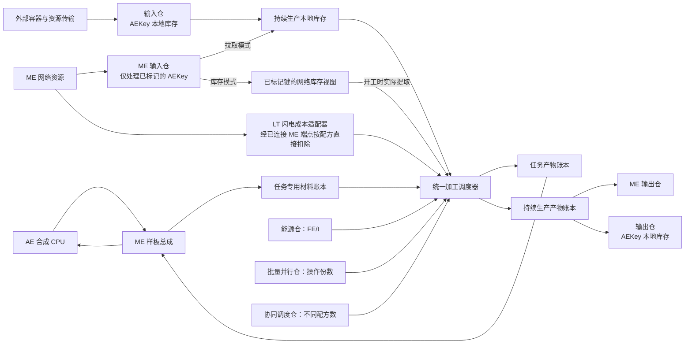

# 大型过载处理工厂总体设计

[文档首页](../README.md)

适用环境：Minecraft 1.21.1、NeoForge、Java 21。本文说明设计目标、集成边界与总体模型。各专题中的容量、等级数值与性能限额为默认设计参数，支持配置调整。

## 与通用框架的关系

大型过载处理工厂接入[完整通用多方块框架](../通用多方块框架/设计总览.md)。框架负责搭建、仓室、配方编译、材料分配、消耗、调度、产出与恢复；工厂只提供结构定义、配方来源适配、运行参数、模型展示与闪电成本扩展。

工厂各专题见[设计目录](设计目录.md)。实施以前置框架独立验收通过为起点，再接入本机功能。

## 本机设计目标

- 使用独立大型工厂 ID 与旧单方块过载工厂并存，覆盖其有效配方并通过适配器接入其他来源。
- 选用框架长方体预设，映射过载约束框架、工厂外壳和处理核心，配置本机仓室安装上限。
- 使用通用八类仓室与完整 AE 任务/持续生产流程，采用本机并行封顶、线性 FE 和调度参数。
- 注册 LT 闪电成本及处理核心的等级替代规则，不改变通用仓室或框架的资源协议。
- 复用框架控制器、预览、指南与恢复能力，仅提供工厂的资源模型、配方来源和专有展示。

仓室类型与容量、自动物流、任务归属、耗能、产出和恢复的统一规则见[框架设计总览](../通用多方块框架/设计总览.md)；本机选值见[配方接入与机器参数](配方接入与机器参数.md)。

## 集成边界

大型工厂使用独立注册 ID，与单方块过载工厂并存。通用框架及仓室位于 Thunderbolt Core Reborn；工厂控制器、外壳/核心、模板、配方与闪电适配位于 AE2 Lightning Tech Reborn。

| 对接模块 | 设计要求 |
| --- | --- |
| [过载配方目录](https://github.com/AE2-Lightning-Tech-Reborn/AE2-Lightning-Tech-Reborn/blob/484102a1707a28df81efe16df8f4696d24521fe1/src/main/java/com/moakiee/ae2lt/machine/overloadfactory/recipe/OverloadProcessingRecipeCatalog.java) | 读取最终 RecipeManager 中的本体、处理器推导与可选反应仓配方；不创建会绕过数据包删除的副本 |
| 材料分配 | 使用与物理槽数无关的输入视图及消耗计划，支持跨多个仓室取料 |
| [TB 批量 provider](https://github.com/AE2-Lightning-Tech-Reborn/Thunderbolt-Core-Reborn/blob/ac04c10f1a09cd5c2cef3655dd623ca681a2d54f/src/main/java/com/moakiee/thunderbolt/api/crafting/batch/IBatchCraftingProvider.java) | 接收单份只读材料模板，返回未接收份数；所有总成共享工厂预算 |
| [TB 任务视图](https://github.com/AE2-Lightning-Tech-Reborn/Thunderbolt-Core-Reborn/blob/ac04c10f1a09cd5c2cef3655dd623ca681a2d54f/src/main/java/com/moakiee/thunderbolt/api/crafting/batch/BatchJobView.java) | 仅在调用内借用，复制必要稳定标识，不保存 CPU 内部对象 |
| [矩阵回传契约](https://github.com/AE2-Lightning-Tech-Reborn/AE2-Lightning-Tech-Reborn/blob/484102a1707a28df81efe16df8f4696d24521fe1/src/main/java/com/moakiee/ae2lt/crafting/runtime/api/DeferredCraftingProvider.java) | 同步 OutputSink 不用于耗时任务；加工完成后走 AE 正常网络收货路径 |
| [闪电 API](https://github.com/AE2-Lightning-Tech-Reborn/AE2-Lightning-Tech-Reborn/blob/484102a1707a28df81efe16df8f4696d24521fe1/src/main/java/com/moakiee/ae2lt/api/lightning/LightningApi.java) | LT 适配器通过活动 ME 端点执行真实网络扣除；模拟查询不预留资源 |
| [控制器状态存储](https://github.com/AE2-Lightning-Tech-Reborn/AE2-Lightning-Tech-Reborn/blob/484102a1707a28df81efe16df8f4696d24521fe1/src/main/java/com/moakiee/ae2lt/logic/persistence/ControllerMachineStateSavedData.java) | 以机器 UUID 保存唯一权威运行状态，仓室不复制任务记录 |

源码链接指向两个项目已发布到远端的代码版本，便于在仅包含文档的 `docs` 分支中查阅；本文的目标设计不代表这些版本已实现全部功能。

## 项目职责与实现落点

| 所属项目 | 职责 |
| --- | --- |
| TB 结构内核 | 定义、坐标、扫描、绑定、变更索引与生命周期 |
| TB 建造与部件 | 预览、自动搭建、八类仓室/总成、库存、物流、FE/ME、通用菜单 |
| TB 加工运行时 | 配方与样板编译、取料、托管、消耗、调度、产出、回流及持久化恢复 |
| TB 公共契约 | 不可变定义、最小服务接口、既有批量协议和存储接口 |
| LT 工厂接入 | 工厂控制器/外壳/核心、框架预设引用、角色映射、部件装配、配方来源和默认参数 |
| LT 专有适配 | 闪电成本、等级替代、网络来源策略及本机展示扩展 |

框架没有 LT 内容依赖，工厂不维护第二套通用加工器、仓室或账本。源码对接表用于识别现有集成来源，不代表继续把通用执行模块保留在 LT 内。

## 总体模型

工厂采用“一个控制器、一套运行账本、多种可替换仓室”的模型。结构体积提供安装空间；能源仓决定每 tick 能做多少工作，批量并行仓决定可同时加工的配方操作份数，协同调度仓决定同时运行的不同配方数量。增加样板容量不增加加工速度，扩大空壳也不直接增加吞吐。

图中的 AE 任务回传使用 AE 原有网络收货流程，不意味着工厂持有 CPU 对象或实现了新的直连回调协议。

## 相关文档

- [配方接入与机器参数](配方接入与机器参数.md)
- [仓室接入方案](仓室接入方案.md)
- [结构与建造设计](结构与建造设计.md)
- [仓室目录](../通用多方块框架/仓室/仓室目录.md)
- [生产流程设计](../通用多方块框架/加工/生产流程设计.md)
- [通用多方块框架设计](../通用多方块框架/设计总览.md)
