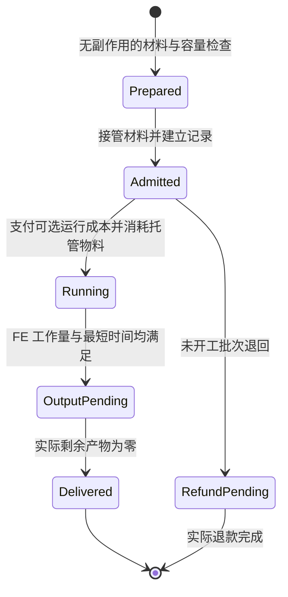

# 运行状态与持久化

[文档首页](../../README.md)

框架运行时统一管理批次、资源托管、进度、输出和退款；具体机器提供稳定身份与执行描述，不各自实现相同状态机。

## 任务状态机

缺电、缺少活动结构、等待配方通道和输出阻塞作为暂停原因附在记录上，不建立会复制物料的另一份任务。`Prepared` 不跨 tick 保存资源承诺；`Admitted` 才是所有权转移点。

开始加工前确认普通物料和账本空间已经准备好，并完成本批已声明额外成本的真实支付。扣费成功与 `Running` 状态切换由同一服务器线程提交，记录已支付成本和已消耗物料，FE 按进度继续支付。扣费部分失败时留在 `Admitted` 并先执行原路补偿；不会产生加工进度。未开工可以退回托管物料；已经开工的操作是暂停或继续完成，不允许保留进度并全额退回已消耗投入。

用户取消 AE 合成任务不等于机器收到一个可靠的异步取消消息。首期不依赖不存在的取消回调：已接收加工继续完成，原 CPU 不再收货时，成品作为普通库存返回原路。控制器的“停止接单”允许排空，不擅自删除正在执行的任务。

## 最小持久化字段

| 范围 | 保存内容 |
| --- | --- |
| 控制器 | `schemaVersion`、机器 UUID、模板 ID/尺寸、朝向、运行策略、升级、下一个提交序号 |
| 加工批次 | 批次 ID、来源类型、可选 crafting ID、源端口身份、配方 ID/指纹、执行快照、源配方次数、已支付 FE、有效加工时间、状态 |
| 资源归属 | 尚未消耗的托管资源、本地/网络来源与退款路由、额外成本来源、实际扣除键与数量、成本支付状态、部分扣费补偿记录、已消耗标记、待交付输出剩余量 |
| 仓室 | 部件身份、分级部件的等级、AEKey 本地库存或能源仓 FE、标记与过滤、拉取模式目标量/低水位、ME 输入模式、自动拉取/输出开关、外侧方向、模式切换待返还数据、绑定提示；ME 仓数量与目标量以精确大整数序列化 |
| 派生缓存 | 不保存网络库存视图的数量副本、AE 网格引用、BlockEntity 引用、capability 包装器、借用模板、JobView 或 OutputSink |

框架以现有控制器 UUID SavedData 模式为参考，统一管理各接入机器的运行记录；样板和物理仓库存各有一个权威持有者。旧控制器被卸载、拆下或替换后，内存实例要停止调度并释放活动租约，不能在其 SavedData 恢复到新实例后仍继续回流。

ME 输入/输出仓的无限容量数据按稳定仓室 UUID 分段保存，不把全部库存、标记与过滤条目塞进一个 BlockEntity NBT 或物品数据包。方块和回收物品只持有身份及必要元数据，重新放置后领取该身份的唯一活动所有权。页大小与内存缓存大小只影响加载和同步方式，不限制总页数、标记数或真实库存量；模式切换及退款记录继续使用相同的权威存储。

## 拆换与资源回收

| 事件 | 预期行为 |
| --- | --- |
| 区块卸载 | 停止接单与处理，保留记录；完整加载后复扫，不能当作方块被破坏 |
| 输入/输出仓拆除 | 保存该仓剩余全部 AEKey 本地库存，随仓室物品或可恢复容器回收；已进入任务托管的材料不重复回收 |
| ME 输入仓拆除 | 拉取模式本地余料优先返还，失败则持久化回收；库存模式只解除网络视图，不搬出或复制网络库存；已取得资源的任务和退款记录仍归控制器 |
| ME 输出仓拆除 | 已接收但尚未回网的产物随该仓持久化回收，不能再次从控制器账本生成或发送 |
| 样板总成拆除 | 样板按自身库存回收；已有任务保留在控制器状态中，相关输出暂停等待原路恢复 |
| 能源仓拆除 | 储能随仓室保存，不从其他能源仓复制或分摊出第二份能源 |
| 并行/调度仓拆除 | 降低新接收能力，已有记录保留；重成形后轮候完成 |
| 控制器拆除 | 控制器物品保留机器身份以恢复运行状态；不会把任务资源再掉落一遍 |
| 数据包模板删除 | 进入模板缺失状态，保留库存与任务，允许选择修复模板或执行资源恢复 |

四类输入输出仓都使用 `AEKey` 序列化保留完整类型与组件；对没有实体掉落表示的键采用持久化回收容器。来源模组临时缺失而无法解析资源键时，保留原始序列化数据并隔离该记录，不按“空资源”删除。控制器物品意外丢失时，提供受权限控制的孤立机器记录查询与恢复入口，避免静默清理仍有资源的 SavedData。

## 数量、溢出与限额

普通仓数量、FE 和单次加工/传输窗口使用非负 `long`；ME 仓本地库存、目标量和累计合并数量使用非负 `BigInteger`。大整数库存按实际执行需求拆成有限 `long` 窗口，成功转移多少就从精确库存扣除多少。单批配方倍增使用精确检查，超出执行窗口时拆分批次，不能用饱和相加截断 ME 库存或把执行窗口上限当作仓室容量。

默认控制器最多同时管理 256 条未完成批次、1,024 条尚未完成所有权移交的输出/退款事务、每批最多 64 种资源键；这些是运行预算，可按实测调整。事务移交给仓室并完成记账后释放运行记录，仓室库存不计入这些限制。批次可按相同配方、输入签名和来源聚合存储，但不得跨来源合并退款或回流归属。

FE 和流体的外部 capability 数量仍受 `int` 限制，按多次调用分段转移。内部单位在边界显式转换，AE 流体数量与 NeoForge mB 的映射必须通过对应 API 核实，不能照搬其他加载器版本的单位。

## 相关文档

- [资源契约](资源契约.md)
- [仓室物流通用规范](../仓室/物流通用规范.md)
- [网络连接与权限设计](网络连接与权限设计.md)
