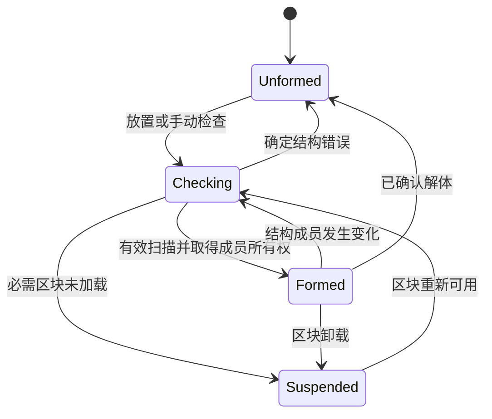

# 生命周期与变更调度

[文档首页](../README.md) · [框架设计总览](设计总览.md)

## 结构状态机

`Formed` 仅说明结构有效；缺电、额外成本不足、没有活动网络和输出阻塞分别属于运行状态。GUI 同时显示结构状态和运行原因，避免把所有问题合并为“未成形”。

## 变更索引与调度

每维度维护成员位置和覆盖区块到控制器的反向索引。普通方块变化只标记有关控制器脏，同一 tick 合并请求；失效门禁立即生效，完整复扫可以排队。尚未成形的控制器登记有界候选区域，保证最后一块结构放好后仍能被唤醒。

## 缓存与线程约束

稳定结构不逐 tick 遍历所有方块。库存、样板、配方和端口拓扑各自维护版本，变化只重建相应缓存。服务器线程执行所有世界、库存、网格和能量操作；后台线程最多处理已复制的不可变展示数据。

## 生命周期通知

结构内核只通知 `onFormed`、`onSuspended`、`onReformed` 和 `onDisassembled` 等事件，不擅自退款、掉落物品或丢弃加工进度。框架加工运行时依据机器策略处理暂停、退款和恢复，并保留已接收资源的唯一归属。

`onFormed` 通知机器结构首次可用；`onSuspended` 通知必需条件暂不可判断；`onReformed` 通知重新验证并绑定后可恢复；`onDisassembled` 表示已确认解体。框架运行时据此关闭接单、保存状态或恢复运行，不能将暂停等同于资源丢失。

## 工作预算

成形扫描只在相关变化后执行，同 tick 多次变化合并；全服务器设扫描工作预算，超出预算排队且保持接单门禁关闭。扫描的排队不延后旧服务的失效，机器不在等待复扫时继续接受材料。

## 相关文档

- [成员绑定与所有权](成员绑定与所有权.md)
- [部件接口与扩展边界](部件接口与扩展边界.md)
