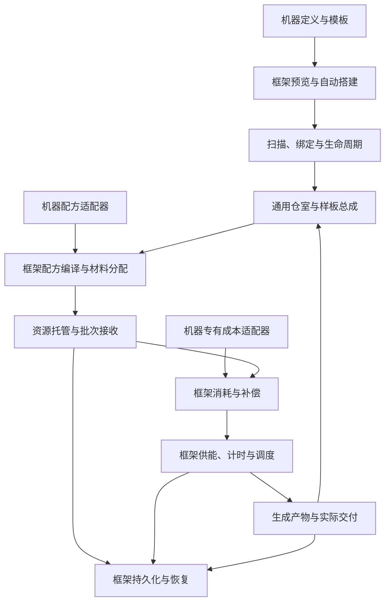

# 通用多方块框架设计总览

[文档首页](../README.md)

本框架提供一套完整的多方块机器能力：**定义与搭建 → 成形与绑定 → 仓室与物流 → 配方处理 → 物料及能源消耗 → 调度与加工 → 产出与回流 → 保存与恢复**。大型过载处理工厂接入这套能力，提供自身的结构、配方适配、参数与闪电成本扩展。

适用环境：Minecraft 1.21.1、NeoForge、Java 21。模块与类名为目标设计，文档不表示功能已经实现或发布。

## 设计目标

- 同一套框架支持不同完整机器，不为每台机器复制搭建器、仓室、加工器、耗能逻辑或运行账本。
- 一份结构定义同时驱动扫描、预览、材料清单和自动搭建。
- 通用仓室保存自己的库存、样板和能源；框架运行时按机器身份统一管理任务、托管、消耗与产物。
- 所有加工保留真实配方验证、实际扣除、工作量和加工时间，资源在各阶段始终只有一个所有者。
- 结构和资源变更驱动有界调度，支持多机器、公平批量、暂停、拆换和正常存档恢复。
- 接入机器只声明差异：结构与装配、有效配方来源、默认策略、专有成本及必要的展示扩展。

## 完整运行链路

框架执行各阶段，机器适配器提供真实配方和额外成本的具体含义。专有适配器不接管通用状态机，也不另建会重复产出或扣费的运行实例。

## 模块职责

| 框架模块 | 提供的能力 |
| --- | --- |
| 结构内核 | 通用预设、形状生成、定义编译、坐标变换、扫描、成员独占、结构版本与生命周期 |
| 建造与交互 | 模板/尺寸选择、分层预览、缺料诊断、自动搭建和维护操作 |
| 通用部件 | 八类仓室与总成、AEKey 库存、FE/ME 接口、能力贡献、菜单和独立保存 |
| 配方与样板 | 统一执行描述、来源版本、材料分配、真实配方及倍率校验、样板发布 |
| 加工运行时 | AE 任务与持续生产、批次接收、共享预算、公平调度、时间与产出 |
| 消耗与交付 | 实际取料、FE 支付、额外成本调用、补偿、输出背压和原路回流 |
| 持久化与恢复 | 机器 UUID、唯一运行实例、资源账本、拆换、卸载、退款及诊断恢复 |

结构内核只负责结构事实；加工运行时负责资源和执行。这是框架内部的模块分工，两者均属于完整框架，不要求接入机器自行补写通用加工链路。

## 工程归属与依赖

通用框架放在 Thunderbolt Core Reborn。`core.multiblock` 维护结构内核，`api.multiblock` 在成熟后开放不可变定义与最小契约；建造、仓室、配方编译、加工调度、消耗与持久化按上述职责分模块组织，复用 TB 批量协议与存储接口。

结构内核不需要理解 AEKey、FE 或配方，通用部件和加工模块可以使用对应接口。框架不依赖 LT 的工厂类、配方注册或 `LightningKey`；LT 只提供大型工厂定义、配方来源适配、参数、资源模型和闪电适配器。

每个机器 UUID 对应唯一活动运行实例。框架内部状态不通过公共 API 暴露可变引用，也不把 CPU 对象、借用模板或同步 OutputSink 保存到异步任务中。

## 文档入口

| 主题 | 文档 |
| --- | --- |
| 定义与建造 | [结构定义与模板](结构定义与模板.md)、[结构预设与形状生成](结构预设与形状生成设计.md)、[搭建与预览](搭建与预览设计.md) |
| 扫描与绑定 | [结构扫描与诊断](结构扫描与诊断.md)、[成员绑定与所有权](成员绑定与所有权.md) |
| 生命周期与接入 | [生命周期与变更调度](生命周期与变更调度.md)、[部件接口与扩展边界](部件接口与扩展边界.md) |
| 通用仓室 | [仓室目录](仓室/仓室目录.md)，含八类独立部件设计与共用规范 |
| 配方与生产 | [配方描述与样板编译](加工/配方描述与样板编译.md)、[生产流程](加工/生产流程设计.md) |
| 资源与消耗 | [资源契约](加工/资源契约.md)、[运行成本与消耗接口](加工/运行成本与消耗接口.md)、[耗能与调度](加工/耗能与调度设计.md) |
| 交付与恢复 | [产物路由与库存目标](加工/产物路由与库存目标.md)、[网络连接与权限](加工/网络连接与权限设计.md)、[运行状态与持久化](加工/运行状态与持久化.md) |
| 界面与配置 | [界面与交互](界面与交互设计.md)、[配置与参数版本](配置与参数版本.md) |
| 实施与兼容 | [实施路线](实施与验收.md)、[验收与性能预算](验收与性能预算.md)、[既有多方块迁移](既有多方块迁移.md) |

## 首个接入机器

[大型过载处理工厂](../大型过载处理工厂/设计目录.md)引用框架长方体预设，声明处理核心映射、仓室安装上限、过载配方来源和闪电成本，复用框架完整运行链路。先让框架通过不依赖 LT 的完整机器验收，再验证该工厂的接入配置。
